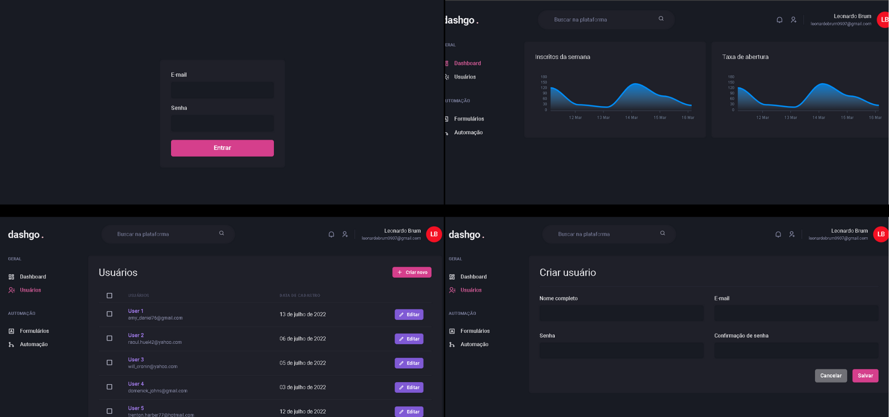

<h1 align="center">Dashgo.</h1>

<div>
  
</div>

# About this Project

  Dashgo is a Dashboard developed for user control, the purpose of this application is to practice my knowledge in NextJS, React Query and programming logic.
  
# Functionalities

- User data validation on login screen.
- Get user data from a fake API.
- Lists only 10 users, being able to access the rest through pagination.
- Cache user data.

# Some Observations about this App

- There's no functionality of Login/Register, only data validation.

# Getting Started

### Installing

**Cloning the Repository**

```
$ git clone https://github.com/LeonardoBrum0907/dashgo.git

$ cd dashgo
```

**Installing dependencies**

```
$ yarn
```

_or_

```
$ npm install
```

# Built With

- [React-Native](https://facebook.github.io/react-native/) - Build the native app using JavaScript and React
- [React-Navigation](https://reactnavigation.org/docs/en/getting-started.html) - Router
- [Redux](https://redux.js.org/) - React State Manager
- [Redux-Saga](https://redux-saga.js.org/) - Side-Effect middleware for Redux
- [Axios](https://github.com/axios/axios) - HTTP Client
- [ESlint](https://eslint.org/) - Linter
- [React-Native-Dotenv](https://github.com/zetachang/react-native-dotenv) - Configs from .env file
- [Flow](https://flow.org/) - Static Type Checker
- [Prettier](https://prettier.io/) - Code Formatter
- [Babel](https://babeljs.io/) - JavaScript Compiler
- [Reactotron](https://infinite.red/reactotron) - Inspector
- [Styled-Components](https://www.styled-components.com/) - Styles

##

<div align="center">
  
</div>
